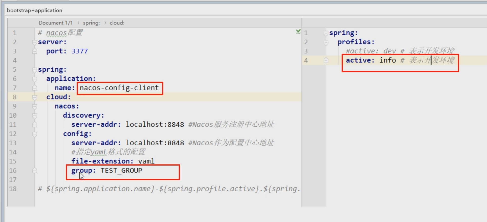

# https://github.com/alibaba/spring-cloud-alibaba/blob/master/README-zh.md


新建nacos模块

父工程引入

```
<dependencyManagement>
    <dependencies>
        <dependency>
            <groupId>com.alibaba.cloud</groupId>
            <artifactId>spring-cloud-alibaba-dependencies</artifactId>
            <version>2.1.1.BUILD-SNAPSHOT</version>
            <type>pom</type>
            <scope>import</scope>
        </dependency>
    </dependencies>
</dependencyManagement>
```

子模块

```java
<dependency>
    <groupId>com.alibaba.cloud</groupId>
    <artifactId>spring-cloud-starter-alibaba-nacos-discovery</artifactId>
</dependency>
```

安装nacos   在bin下运行  以单机启动

# startup.cmd -m standalone


建立9001  9002  copy  虚拟9003


内部自己整合了ribbon  


# 配置中心


# 再次注意！接口方法不能为private


修改nacos  及时更新


DataID 就是dev  test 环境区别

# group





# namespace


# 集群和持久化


修改DB的配置  修改cluster.conf


 

启动3个nacos 加入 -p 端口

