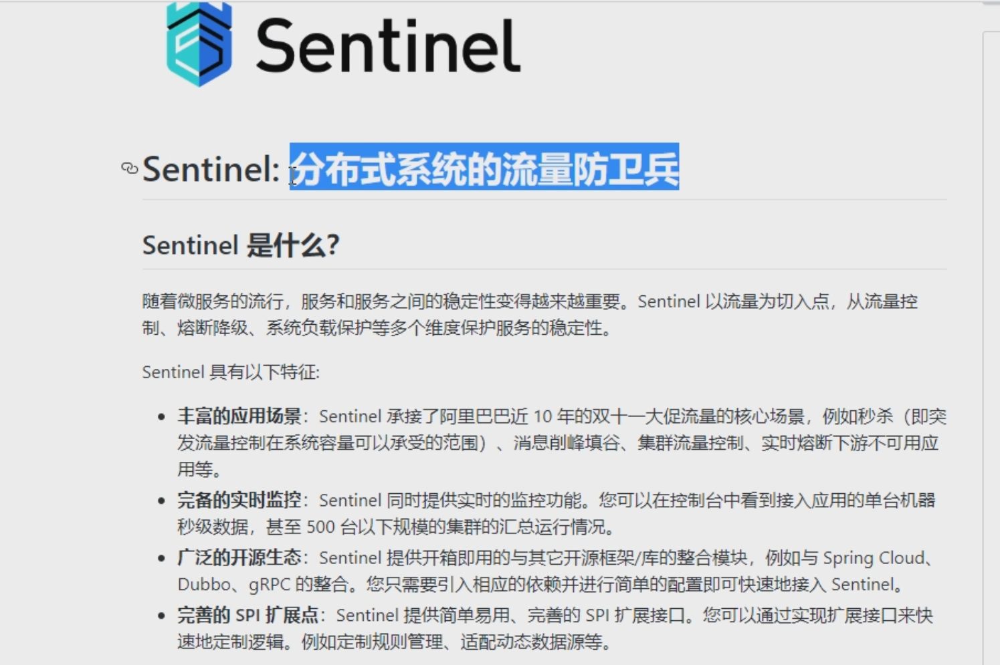
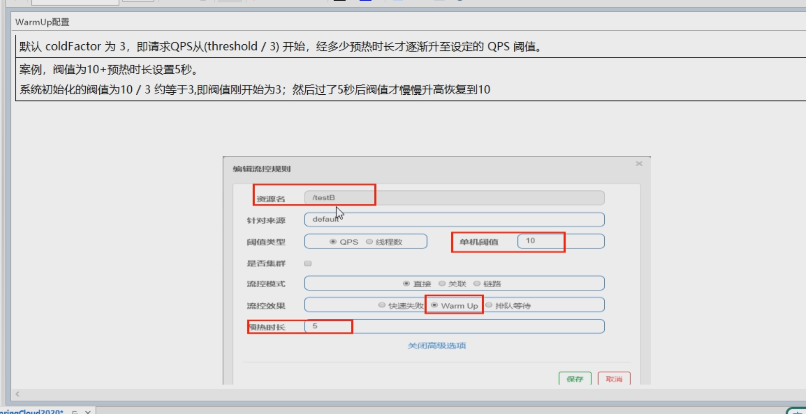
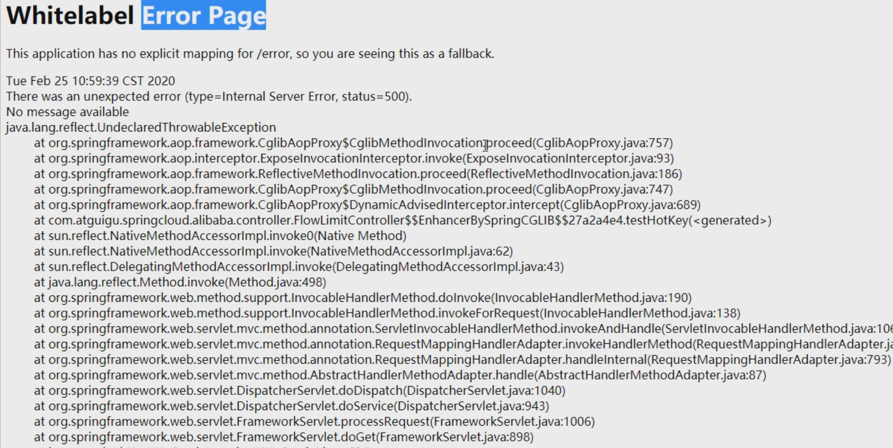
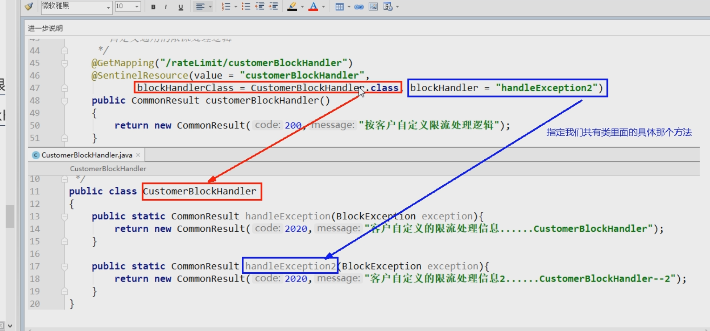
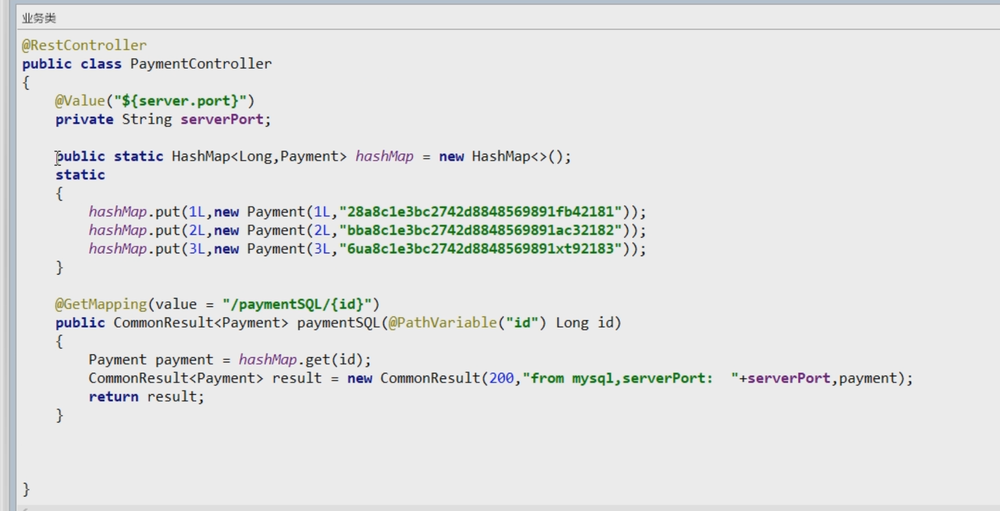
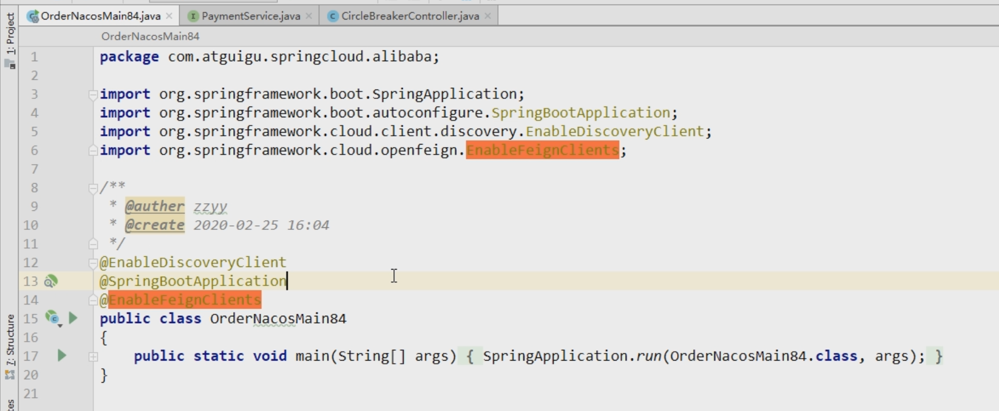

https://github.com/alibaba/Sentinel/releases

# java -jar sentinel-dashboard-1.7.2.jar

# http://localhost:8080/#/login

# 流控

触发快速失败  类似熔断

控制线程数

# 关联

链路

# 预热

排队

# 熔断降级

# RT

1秒10次

# 异常比例

# 异常数

# 热点key

其他配置

# 系统自适应限流

# 按资源名称限流  自定义返回

# 按URL限流 使用自带

配置全局自定义

新建84

加入fallback

加入blockHandler

点一次4

多次4

一次5

多次5

忽略异常

feign

关闭9003  9004

# sentinel  持久化

# 需要调用出现持久化

