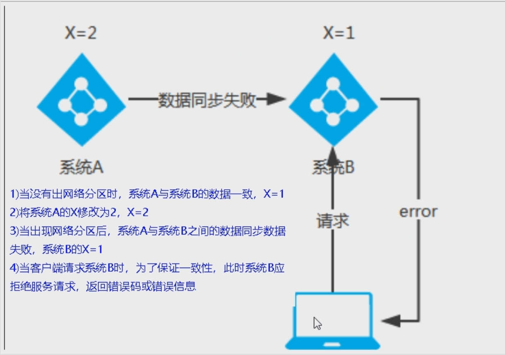

# CAP理念


# 服务注册中心解决的问题

- ```java
  # 服务注册中心解决的问题
  
  　　服务注册中心主要解决两个关键问题：服务注册和服务发现。
  
  - 服务注册：服务实例将自身服务信息注册到注册中心。这部分服务信息包括服务所在主机IP和提供服务的Port，以及暴露服务自身状态以及访问协议等信息。
  - 服务发现：服务实例请求注册中心获取所依赖服务信息。服务实例通过注册中心，获取到注册到其中的服务实例的信息，通过这些信息去请求它们提供的服务。
  
  　　除了这两个核心功能之外，一般服务注册中心还需要监控服务实例的运行状态，负载均衡等问题。
  
  - 监控：服务实例一直处于动态的变化中，因此我们需要监控服务实例的健康状况，从注册中心剔除无用的服务。一般实现心跳连接等。
  - 负载均衡：在一个服务有多个实例的情况下，我们需要根据负载均衡策略正确处理请求。
  ```

  

# AP架构 （eureka）


# CP架构（ZK/consul）




