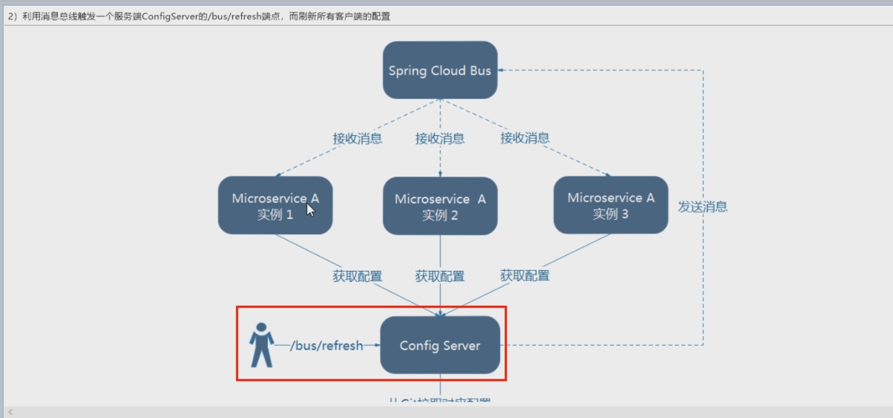
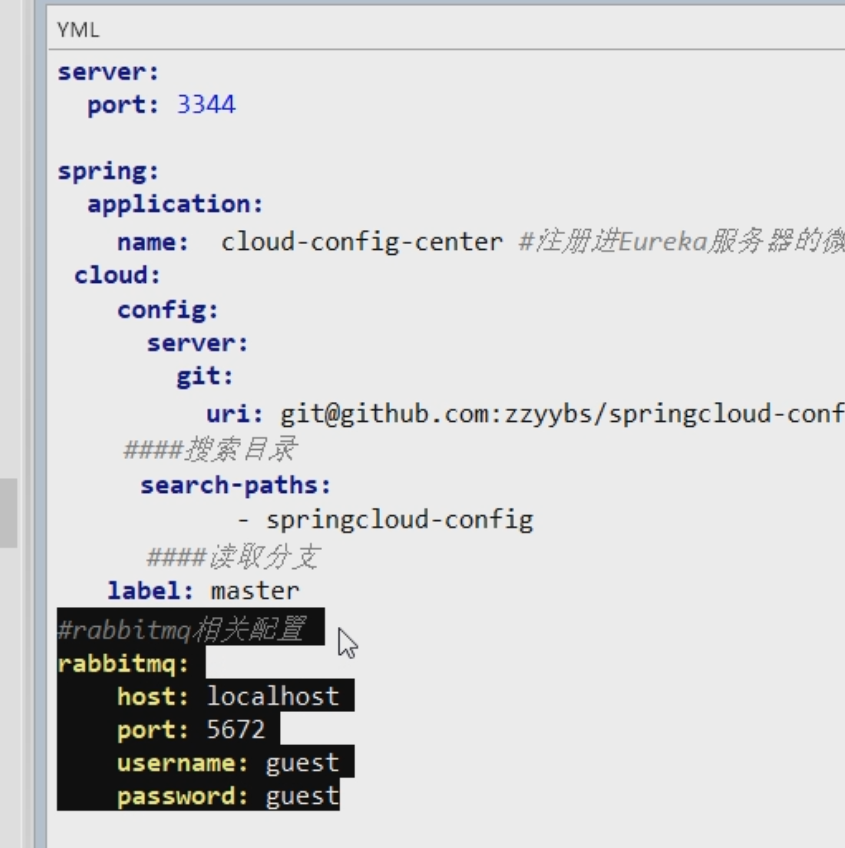

新建3366

3344添加依赖

修改3355 3366  添加上面的依赖和yml的rabbitmq部分  不用暴露端点

启动服务  修改git上的config

# curl -X POST "HTTP://配置中心IP:配置中心端口/actuator/bus-refresh"

# 均已生效

# curl -X POST "HTTP://配置中心IP:配置中心端口/actuator/bus-refresh/微服务名称:需要生效的端口"

# 实现3355生效  3366不生效

